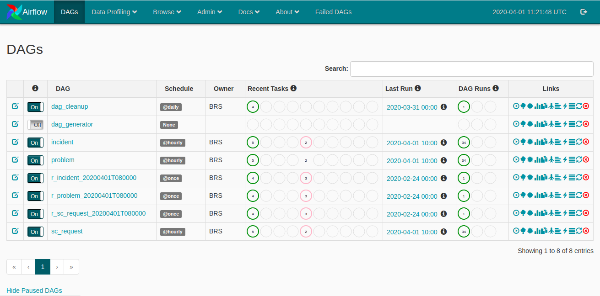

# User Interface

Apache Airflow provides a great UI for monitoring of you DAGs.

* **DAGs**: mini-BRS overview of DAGs.



* **Graph View**: generated ServiceNow DAG's dependencies and their current status for a specific run.


##How to Use
mini-BRS use Apache Airflow as a work flow management platform, if you are not aware of basic concepts of Airflow please
checkout the [documentation](https://airflow.apache.org/docs/stable/concepts.html).  

## What mini-BRS Can Do ?
* It can be used to backup you ServiceNow data.
* It can be used to ingest historical data to cloud storage's.
* It can be used to orchestrate your custom workflows for ServiceNow.


## Connections
Before running any workflows (DAG's) make sure you specify the requisite connections to the external services required for
the functioning of workflows.

Connection's can be found via **Admin** tab in the navigation bar, Click on Admin tab and select **Connections** from the
drop down menu, you will be redirected to airflow connections page, Airflow allows you to store your external connection
details in the meta database via this page. Few connections are of specific importance to mini-BRS and you as a user have to make sure to configure these connections based on your specific needs. Let's have a look at few such connections.  

#### servicenow_default:
```servicenow_default``` is the connection entry in the meta database which will hold your ServiceNow instance credentials.
This connection is where you would store your ServiceNow instance url and login credentials. If you edit this connection
by clicking on the edit connection icon, you will have form with fields like Conn Id, Conn Type, Host etc. please do not 
change the Conn Id value. Add your ServiceNow instance url to Host field of the form, you need to add the url with 'https'
option added e.g if your instance is dev1234.service-now.com save it as https://dev1234.service-now.com in the 'Host' field
of the form. Also you need to add ServiceNow user name to 'Login' field and password to 'Password' field of the form.

#### sftp_default:
```sftp_connection``` If you want to ingest your ServiceNow instance data to an SFTP account, you can add the SFTP connection
details in `sftp_default` connection entry. Add sftp account name in the `Login` field and sftp account password in the `Password`
field of the form, nothing else needs to be changed.

#### s3_default:
```s3_default``` If you want to ingest your ServiceNow instance data to Amazon S3 account, you need to have `access_key_id` 
and `secret_key_id` for your s3 storage. Add `access_key_id` to `Login` and `secret_key_id` to `Password` field of the 
`s3_default` connection. 

#### dropbox_default:
`dropbox_default` mini-BRS provides you an option to ingest your ServiceNow instance data to `Dropbox` account, for this
you need to generate `access_token` for your dropbox account and add that `access_token` to the `Password` field of the
connection. In order to generate `access_token` for you account please check out the following [link](#).

## Variables
mini-BRS uses Airflow Variable as a single point to configure ServiceNow workflows. Once you have installed mini-BRS and 
added ServiceNow and storage connection details to the there respective connection ids, you can configure your workflows 
via configuration variables provided by mini-BRS. You can find configuration variables via Airflow UI, go to Admin link in nav bar, 
click Variables options you will see few variables already defined. these variables are needed to be present for mini-BRS functioning
.

**config**: ```config``` variable provides you options to generate workflows. it uses JSON format to store values. 

```json
{
  "tables": ["incident","problem","sc_request"], 
  "start_date": "1da", 
  "frequency": "hourly", 
  "threshold": 10000, 
  "export_format": "xml", 
  "storage_type": "dropbox", 
  "email": ""
}
```

Options

 - tables : ```tables[]``` is an array where you can add the ServiceNow table names as comma separated values from which
 you want to ingest data to the storage. Please ensure the values inside the table should be valid ServiceNow table names.
 
 - start_date : ```start_date``` provides you a way to get historical data from your ServiceNow instance. It takes values
 of format ```xda``` , where ```x``` is an integer value which specifies the number of the days in past to fetch data.
 
 - frequency : ```frequency``` refers the schedule interval of the work flow. It can take value such as ```half-hourly```,
 ```hourly```, ```daily``` etc. 
 
 - threshold : ```threshold``` is used to specify the threshold of records fetched from the ServiceNow instance. By default 
 it is placed at its maximum value of 10000, placing a value greater than 10000 is not going to do any good, if the number of data records for a specific run exceeds threshold, No data will be fetched for that period. In that case try to change the ```frequency``` of your workflow to some lower value.
 
 - export_type: ```export_type``` is used to specify the format of data to be stored in the storage, default is ```xml```.
 
 - storage_type: ```storage_type``` is used to specify the type of storage to be used for ingesting data, currently mini-BRS
  has support for AmazonS3, DropBox and SFTP. The credentials of these storage's are to be stored in Airflow Connections in their specific connection_ids.
  
 - email: ```email``` If you have configured SMTP server details during installation or you have manually set them in
 ```airflow.cfg``` file  then you can specify the email_address here to which the failure alerts should be sent.
 
 
 The other two variables ```dag_creation_dates``` and ```r_config``` are meant for internal usage, there presence is
 necessary for normal functioning of mini-BRS.

